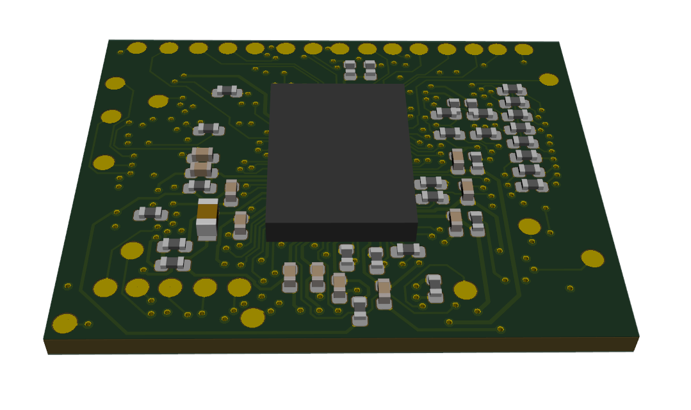

GEM2 Adapter
============

This repository contains PCB design files for adapter board accommodating a GEM1 chip prepared jointly by `zGlue <http://zglue.com>`_ company and `Antmicro <http://www.antmicro.com>`_.
The GEM1 design utilizes chiplet technology and includes the following components placed on dynamically reconfigurable interposer:

* 1x RISC-V ASIC implementation (see `raven-picorv32 <https://github.com/efabless/raven-picorv32>`_ and associated resources)
* 1x Lattice ``ICE40UP5K-UWG30ITR`` FPGA image processing
* 32Mbit SPI FLASH memory
* 12MHz system clock generator 
* Internal LDOs and power management unit maintaining 1V2, 1V8, 2V5, 3V3 system supplies

The chip is supplied from a single voltage ``VUSB`` of 5 VDC.
The board break-routes signals for MIPI Interfaces (Input and Output) along with Flash and FPGA programming pins and power supplies.
