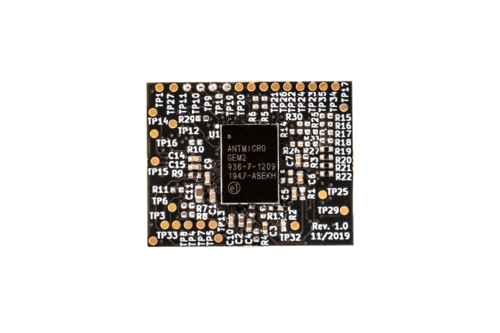

GEM2 Adapter
============

Copyright (c) 2020 `Antmicro <https://www.antmicro.com>`_

This repository contains PCB design files for an adapter board accommodating the GEM2 chip created jointly by `zGlue <http://zglue.com>`_ and `Antmicro <http://www.antmicro.com>`_.
The `GEM2 design <https://zglue.com/design-automation/oci/project/gem2>`_ utilizes the zGlue ZiP chiplet technology and has been prepared using zGlue's `ChipBuilder <http://chipbuilder.zglue.com/>`_ tool.
The design has been produced as a single integrated circuit in the LGA-96 package.

The GEM2 chip contains the following components located on a dynamically reconfigurable interposer:

* PicoRV32-based "Raven" RISC-V ASIC implementation (see `raven-picorv32 <https://github.com/efabless/raven-picorv32>`_ and associated resources)
* Lattice ``ICE40UP5K-UWG30ITR`` FPGA image processing
* 32Mbit SPI FLASH memory
* 12MHz system clock generator 
* Internal LDOs and power management unit maintaining 1V2, 1V8, 2V5, 3V3 system supplies

The chip is supplied from a single ``VUSB`` voltage of 5 VDC.
The board break-routes signals for MIPI Interfaces (Input and Output) along with Flash and FPGA programming pins and power supplies.
